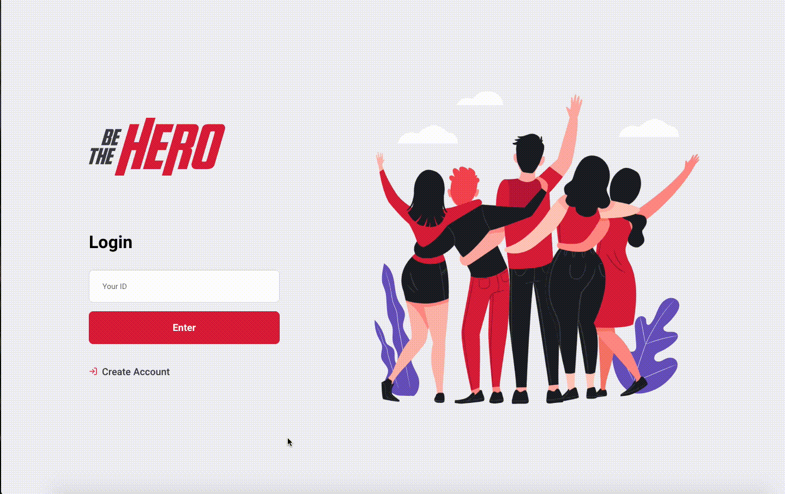
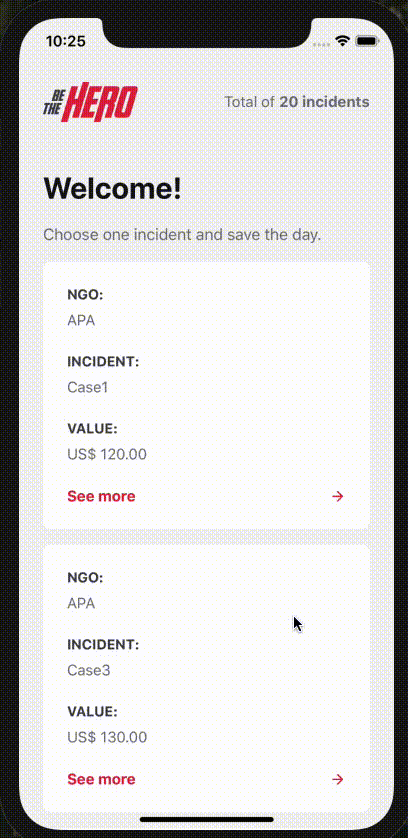
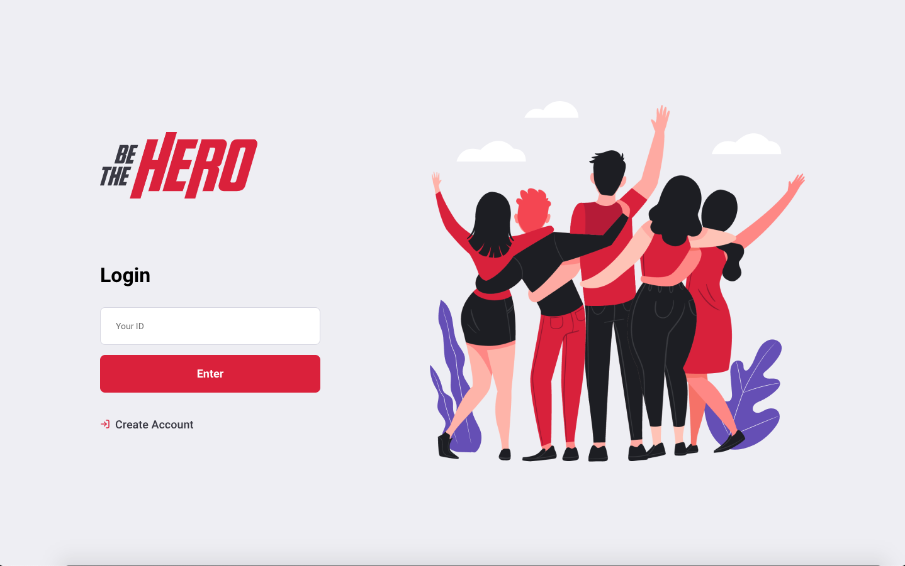
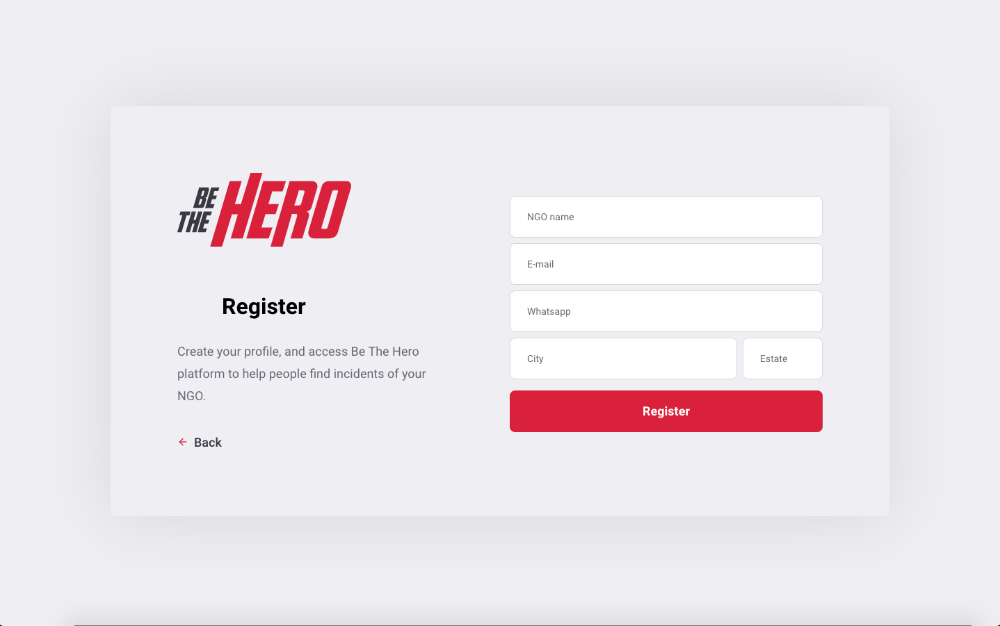
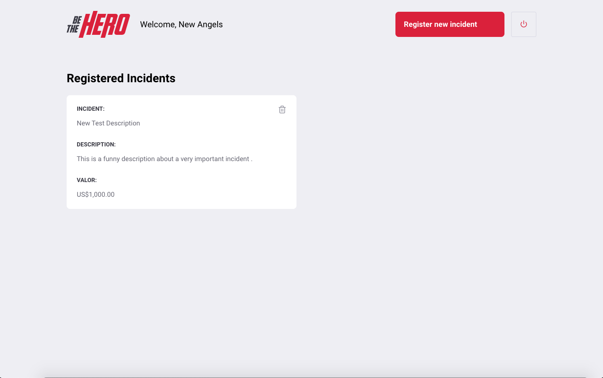
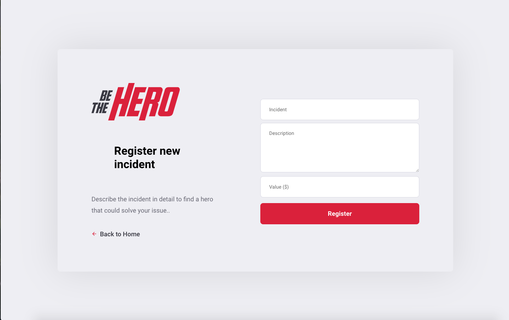

<h1 align="center"></h1>

<div align="center">

     

   [Backend](#Backend) | [Frontend](#Frontend) | [Mobile](#Mobile)

</div>

<h3>
    Application for NGOs to publicize cases that need financial help for people interested in helping. And an Android/iOS app to make easier to new heroes find incidents to help.
</h3>

<p align="center">
    
    
</p>

---

## 🚀 Getting Started
### Backend

The application's backend was developed in NodeJS and the used database was SQLite.

#### 🏎 Start

1. Go to the *backend* folder
2. Install dependencies:
```
yarn
```
3. Run project: 
```
yarn start
```

### Frontend

The application's frontend was developed in ReactJS. The application has a login, a page to create NGOs, a dashboard page that helps the NGOs manage their incidents.

#### 🏎 Start

1. Go to the *frontend* folder
2. Install dependencies:
```
yarn
```
3. Run application: 
```
yarn start
```

### Mobile

The application's mobile was developed in React Native. This app has the purpose to help *heroes* find NGOs' incidents. It was built using [Expo]([https://link](https://expo.io/)) to help the development process.

#### 🏎 Start

1. Go to the *mobile* folder
2. Install dependencies:
```
yarn
```
3. Run application: 
```
yarn start
```

You can see how to configure the simulator of the physical device on [Expo documentation](https://docs.expo.io/workflow/ios-simulator/).

## 🛠 Built With

* [NodeJs](https://nodejs.org/en/) - A JavaScript runtime built on Chrome's V8 JavaScript engine.
* [ReactJs](https://reactjs.org/) - A declarative, efficient, and flexible JavaScript library for building user interfaces.
* [React Native](https://reactnative.dev/) - A framework for building native apps using React.
* [SQLite](https://www.sqlite.org/index.html) - A relational database.
* [Yarn](https://yarnpkg.com/) - Package Manager

<br/>

## 🎖 Author
* **Geraldo Braz** - *Initial work* - [@geraldobraz](https://github.com/geraldobraz)

---
### Screens Shots

<p align="center">
    
    
    
    
</p>


<div align="center">
  <sub>This project was developed during the OmniStack 11 Week by
  <a href="https://rocketseat.com.br/">Rocketseat</a>
</div>
